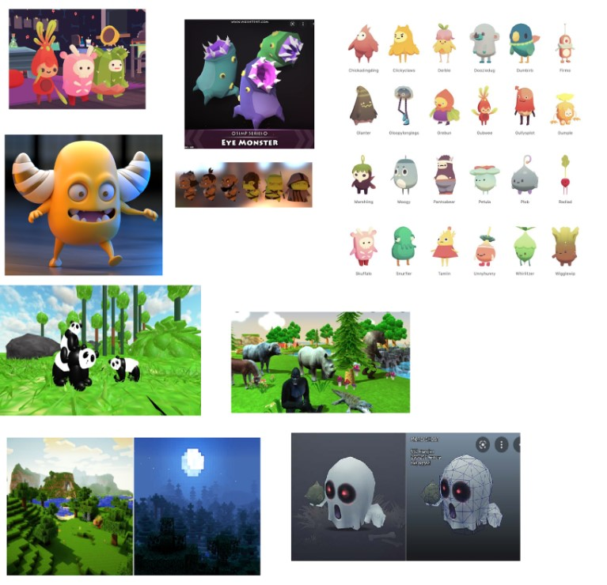

# FantasyWorld

document: https://docs.google.com/document/d/1AGmxGiK0SS1S1V3H_AH3gVGT0Osrj-Gdx7yOD8ias-0/edit?usp=sharing

document 2: https://docs.google.com/document/d/1YgRF_2GSgBN7LVbK5kEuRYtEv-cmzKh4JrDapep5g7c/edit

<FantasyWorld>
  
  
Similar products & Relevant Links(>=3)
  
Name Planet Zoo
  
Url https://www.planetzoogame.com/
  
Relevant Features
  
-there are animals on a map
  
-you can feed them 
  
-you can interact with them

Name Zoo Simulator
  
Url https://store.steampowered.com/app/2129220/Zoo_Simulator/
  
Relevant Features 
  
-explore the map 
  
-feed animals

Name Ooblets
  
Url https://ooblets.com/
  
Relevant Features
  
- unusual animals
  
- Interaction with environment

-------------------------------------------------------------------------------------

Main Features 
  
-Players will be able to explore the map 
  
-Players will be able to interact with animals
  
-Players will be able to experience both cute and creepy animals
  
-Players have the opportunity to see unusual animals

User Journey  
  
The player starts the simulator on the field where ,if he looks around he will soon find unusual animals . If he discovers the secret button he will change the day to night and then around him all the animals become creepy 

Moodboard

------------------------------------------------------------------------------------->>

Technologies, Libraries, Assets (>=5)
  
1.VR Interaction Framework 
  
https://assetstore.unity.com/packages/tools/integration/vrtk-virtual-reality-toolkit-vr-toolkit-64131#description
  
2.VRTK
  
https://assetstore.unity.com/packages/tools/integration/vrtk-virtual-reality-toolkit-vr-toolkit-64131
  
3.Bolt
  
https://assetstore.unity.com/packages/tools/visual-scripting/bolt-163802
  
4.Simple VR Teleporter
  
https://assetstore.unity.com/packages/tools/input-management/simple-vr-teleporter-115996
  
5.Skybox Series 
  
https://assetstore.unity.com/packages/2d/textures-materials/sky/skybox-series-free-103633

DEMO VIDEO:
https://www.youtube.com/watch?v=Tqc4anzzOXs
https://drive.google.com/file/d/1ZHuqhEZ8HrNuEPi_cUSWS19AYiC3DWVE/view
https://drive.google.com/file/d/1EmVO3-_gUwukj4aSt5WZ7d7xn67lB-re/view
https://drive.google.com/file/d/1DShwGG2uo4oRgjQolUXG2qh0Idx-pZLQ/view

